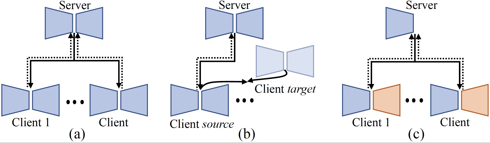
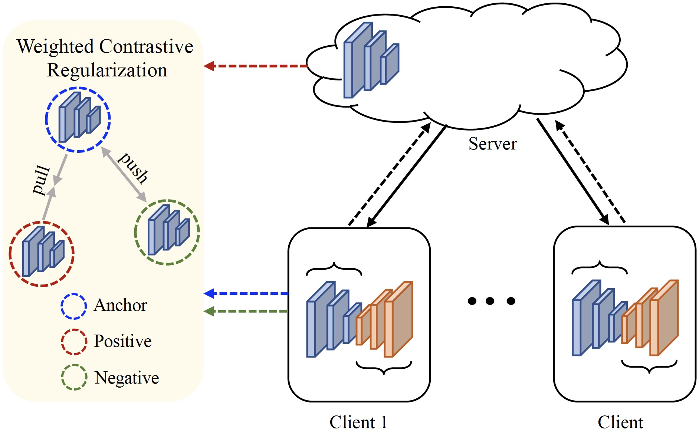

# FedMRI

# [Specificity-Preserving Federated Learning for MR Image Reconstruction]( )

> **Authors:** 
> [Chun-Mei Feng](https://scholar.google.com.hk/citations?user=g2nqHBcAAAAJ&hl=zh-CN), 
> [Yunlu Yan](), 
> [Huazhu Fu](http://hzfu.github.io/), 
> [Yong Xu](https://scholar.google.com.hk/citations?user=zOVgYQYAAAAJ&hl=zh-CN), and 
> [Ling Shao](https://scholar.google.com/citations?user=z84rLjoAAAAJ&hl=zh-CN).


[[Paper]( )][[Code](https://github.com/chunmeifeng/FedMRI)]

## ⚡ Dependencies
* numpy==1.18.5
* scikit_image==0.16.2
* torchvision==0.8.1
* torch==1.7.0
* runstats==1.8.0
* pytorch_lightning==1.0.6
* h5py==2.10.0
* PyYAML==5.4

## ⚡ Overview

### Motivation
----------


Classical FL algorithm for MR image reconstruction: (a) average all the local client models to obtain a general global model, 
or (b) repeatedly align the latent features between the source and target clients. 
In contrast, we propose a specificity- preserving mechanism (c) to consider both generalized shared information 
as well as  client-specific properities.

### Framework Overview
----------


Overview of the FedMRI framework. Instead of averaging all the local client models, a globally shared encoder is used to obtain a generalized representation, and a client-specific decoder is used to explore unique domain-specific information. We apply the weighted contrastive regularization to better pull the positive pairs together and push the negative ones towards the anch
### Results

## ⚡ Data Prepare

Download data from the link https://fastmri.org/dataset/, https://www.med.upenn.edu/sbia/brats2018/data.html 

[[Training code --> FedMRI](https://github.com/chunmeifeng/FedMRI)]

`git clone https://github.com/chunmeifeng/FedMRI.git`

## ⚡ Train
**single gpu train**
"python train.py"
```bash
python train.py
```

**multi gpu train**
"python train_multi_gpu.py"
```bash
python train_multi_gpu.py
```

## ⚡ Citation

```
@inproceedings{feng2021,
  title={Specificity-Preserving Federated Learning for MR Image Reconstruction},
  author={Feng, Chun-Mei and Yan, Yunlu and Fu, Huazhu and Xu, Yong and Ling, Shao },
  journal={arXiv e-prints},
  pages={arXiv--2106},
  year={2021}
}
```


