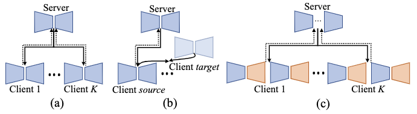

# FedMRI

# [Specificity-Preserving Federated Learning for MR Image Reconstruction](https://arxiv.org/pdf/2112.05752v1.pdf)

> **Authors:** 
> [Chun-Mei Feng](https://scholar.google.com.hk/citations?user=g2nqHBcAAAAJ&hl=zh-CN), 
> [Yunlu Yan](), 
> [Huazhu Fu](http://hzfu.github.io/), 
> [Yong Xu](https://scholar.google.com.hk/citations?user=zOVgYQYAAAAJ&hl=zh-CN), and 
> [Ling Shao](https://scholar.google.com/citations?user=z84rLjoAAAAJ&hl=zh-CN).


[[Paper](https://arxiv.org/pdf/2112.05752v1.pdf)][[Code](https://github.com/chunmeifeng/FedMRI)]

## ⚡ Dependencies
* numpy==1.18.5
* scikit_image==0.16.2
* torchvision==0.8.1
* torch==1.7.0
* runstats==1.8.0
* pytorch_lightning==1.0.6
* h5py==2.10.0
* PyYAML==5.4

## ⚡ Overview

### Motivation
----------


Classical FL algorithm for MR image reconstruction: (a) average all the local client models to obtain a general global model, or (b) repeatedly align the latent features between the source and target clients~\cite{guo2021multi}. In contrast, we propose a specificity-preserving mechanism (c) to consider both ``generalized shared information'' as well as ``client-specific properties'' in both the frequency and image spaces.

### Framework Overview
----------


Overview of the FedMRI framework. Instead of averaging all the local client models, 
a globally shared encoder is used to obtain a generalized representation, 
and a client-specific decoder is used to explore unique domain-specific information. 
We apply the weighted contrastive regularization to better pull the positive pairs together 
and push the negative ones towards the anchor.

### Baselines
Transfer-Site: where the model is transferred across different sites in a random order.

SingleSet: in which each client is trained using their local data without FL;

FedAvg: https://github.com/vaseline555/Federated-Averaging-PyTorch;

FL-MRCM: https://github.com/guopengf/FL-MRCM;

GD-GD: https://github.com/ki-ljl/FedPer;

LG-FedAvg: https://github.com/pliang279/LG-FedAvg?utm_source=catalyzex.com;

FedBN: https://github.com/med-air/FedBN?utm_source=catalyzex.com;

FedProx: https://github.com/litian96/FedProx?utm_source=catalyzex.com;


### Qualitative Results
----------


T-SNE visualizations of latent features from four datasets, where (a-d) show the distributions of SingleSet, FedAvg, FedMRI without Lcon, and our entire FedMRI algorithm, respectively.


## ⚡ Data Prepare

Download data from the link fastMRI:https://fastmri.org/dataset/, 

BraTs: https://www.med.upenn.edu/sbia/brats2018/data.html, 

SMS and uMR will be released after excluding patient personal information.

[[Training code --> FedMRI](https://github.com/chunmeifeng/FedMRI)]

`git clone https://github.com/chunmeifeng/FedMRI.git`

## ⚡ Train
**single gpu train**
"python train.py"
```bash
python train.py
```

**multi gpu train**
"python train_multi_gpu.py"
```bash
python train_multi_gpu.py
```

## ⚡ Contcat
Any problem please feel free to contact me: strawberry.feng0304@gmail.com

## ⚡ Citation

```
@article{feng2021specificity,
  title={Specificity-Preserving Federated Learning for MR Image Reconstruction},
  author={Feng, Chun-Mei and Yan, Yunlu and Fu, Huazhu and Xu, Yong and Shao, Ling},
  journal={arXiv preprint arXiv:2112.05752},
  year={2021}
}
```


